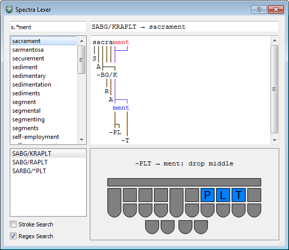

Spectra Lexer
================

The Spectra Steno Lexer is an experimental tool for analyzing and matching patterns of steno keys against the text they produce using various rules from steno theories (mostly Plover theory). It also has advanced search functions for steno dictionaries which have been mostly lacking in Plover up to this point.

Source Installation
-------------------

To run this software on its own from source, you must have a correctly installed Python distribution (3.6 or greater). Download or clone the source into a free directory, change to this directory in a terminal and type:

``python3 setup.py install``

This will install it to your Python distribution as a console script, allowing you to execute the main program by typing:

``spectra_lexer [DICT1 DICT2 ...]``

where each DICT is a path to a JSON file containing a single dictionary mapping steno key sequences to text (the dictionaries used by Plover are in the correct format). You can also execute the script without arguments and load the search dictionaries manually via a dialog from the menu bar. If you are running Windows, the program may be able to find your Plover dictionaries and load them automatically as well.

With Plover
-----------

While it is possible to run Spectra by itself, it is primarily designed as a plugin for Plover. When run as such, the main dialog will automatically load Plover's dictionaries and will attempt to analyze strokes sent from Plover in addition to the manual lookup methods. If you have installed the latest binary release of Plover (4.0.0.dev8 as of this writing), the plugins manager should be able to find this program in the PyPI database and set it up automatically for you.

If you have built and installed Plover from source, it is not likely to have the plugins manager by default. In this case it is possible to install Spectra through pip like any other Python package. Plover searches through all available Python paths to find plugins; so long as it ends up in the same general place that Plover looks for its other dependencies, it should find it just fine. Note, however, that this will NOT work if you are running a pre-built Plover binary, as these are essentially self-contained distributions of Python with their own isolated environment.

Operation
---------

This software is currently experimental with many rules unaccounted for, so do not rely on it to figure out the rules of stenography with 100% accuracy. If it cannot match every single steno key to letters in the word, it will simply not return a result at all (to avoid guessing wrong). Inversions and asterisks are particularly troublesome here; inversions of steno order violate the strict left-to-right parsing that lexers rely on, and oftentimes there is not enough context to figure out the meaning of an asterisk from just a stroke and the word it makes in the absence of other information. Briefs are often constructed by keeping only the most important parts or sounds of a word, and Spectra can usually match these, but briefs relying on strange phonetics or arbitrary sequences of keys simply cannot be matched without pre-programmed custom rules (which are included for some of the most common briefs, but not many).

When searching from the lookup tool, if a word is chosen and there is more than one stroke entry for it, the lexer will attempt to analyze each one and select the one that has the best possibility of being "correct" (i.e. not a misstroke), choosing shorter strokes over longer ones to break ties.
